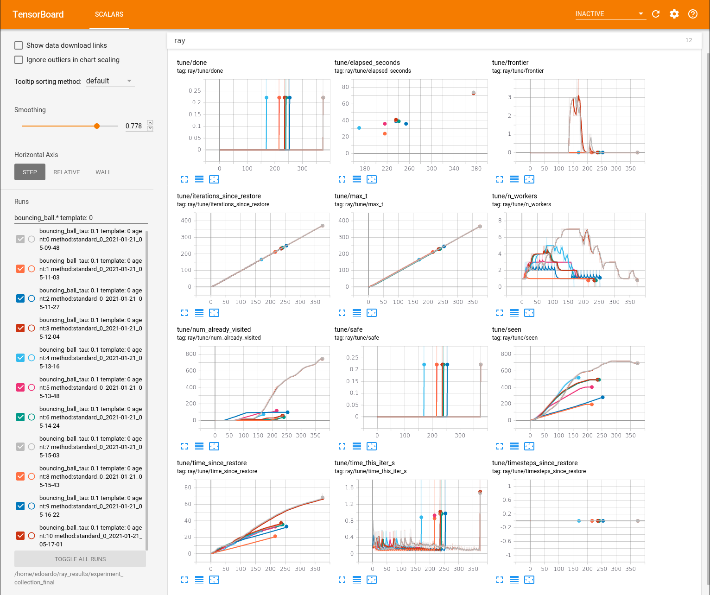

# SafeRL_Infinity #
Repository for the paper "Verifying Reinforcement Learning up to Inifinity"

```
conda create -n SafeRL_Infinity python=3.7

conda activate SafeRL_Infinity

pip install -r requirements.txt

conda config --add channels http://conda.anaconda.org/gurobi

conda install gurobi
```

##Paper results ##
download and unzip [experiment_collection_final.zip](https://mega.nz/file/11xigbgS#ld3MSRAHXUBl1lY-6ltgnmwtm53ESBfL_1WAqAJUSxc) in the 'save' directory

run `tensorboard --logdir=./save/experiment_collection_final`

(results for the output range analysis experiments are in [experiment_collection_ora_final.zip](https://mega.nz/file/psIjUaTL#N-0UzXR8s-LtIGV6DgEj991-YdID4qqDM_f5YLQy14U))

##Train neural networks from scratch ##
run either:
* `training/tune_train_PPO_bouncing_ball.py`
* `training/tune_train_PPO_car.py`
* `training/tune_train_PPO_cartpole.py`
* `conda install -c conda-forge pyomo`
* `conda install -c conda-forge ipopt glpk`

##Check safety of pretrained agents ##
download and unzip [pretrained_agents.zip](https://mega.nz/file/014wHRbB#3OHzROCTyPcq_1lVKVryGgkuRaPBfhme4j7n6GGrWoc) in the 'save' directory

run verification/run_tune_experiments.py

(to monitor the progress of the algorithm run `tensorboard --logdir=./save/experiment_collection_final`)


The results in tensorboard can be filtered using regular expressions (eg. "bouncing\_ball.* template: 0") on the search bar on the left: 

The name of the experiment contains the name of the problem (bouncing\_ball, cartpole, stopping car), the amount of adversarial noise ("eps", only for stopping\_car), the time steps length for the dynamics of the system ("tau", only for cartpole) and the choice of restriction in order of complexity (0 being box, 1 being the chosen template, and 2 being octagon).

The table in the paper is filled by using some of the metrics reported in tensorboard:
* max\_t: Avg timesteps
* seen: Avg polyhedra
* time\_since\_restore: Avg clock time (s)

